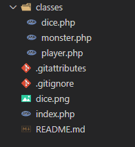

# PHP POO WORKSHOP

For this workshop, you'll need an apache server for running PHP files.

[XAMPP](https://www.apachefriends.org/fr/download.html)

_Clone the content of this repository to xampp/htdocs_

## Looks like this :



### Inside _classes_ folder

**dice.php**

```
<?php

class dice
{
	public function roll()
	{
		return rand(1, 6);
	}

	public function rollAttributes()
	{

		$healthStart = 10;
		$damageStart = 10;

		$blank = NULL;
		$health = $healthStart + ($this->roll() * 5);
		$damage = $damageStart + ($this->roll() * 2);
		$attributes = array($blank, $health, $damage);
		return $attributes;
	}
}
```

**monster.php**

```
<?php

class monster{

			public $health;
			public $damage;

	public function __construct(){
		echo "<br>A monster has appeared!";
	}

	public function setAttributes($attributes){

		foreach ($attributes  as $i => $attribute){
			if ($i = 1){
				$this->health = $attributes[$i];
			}
			if ($i = 2){
				$this->damage = $attributes[$i];
			}

		}

	}

	public function attack($roll){
		echo "<br>The monster attacks! ";

		$damageDealt =  round($this->damage / 6 * $roll);

		echo "<br>The monster damages you for " . $damageDealt;

		return $damageDealt;

	}

	public function takeDamage($damage){
		$this->health -= $damage;
	}

}


?>

```

**player.php**

```
<?php


class player{

			public $name;
			public $health;
			public $damage;

	public function __construct($name){
			$this->name = $name;

	}


	public function setAttributes($attributes){

		foreach ($attributes  as $i => $attribute){
			if ($i = 1){
				$this->health = $attributes[$i];
			}
			if ($i = 2){
				$this->damage = $attributes[$i];
			}

		}

	}


	public function attack($roll){
		echo "<br>You attack the monster! ";

		$damageDealt =  round($this->damage / 6 * $roll);

		echo "<br>You damage the monster for " . $damageDealt;

		return $damageDealt;

	}


	public function takeDamage($damage){
		$this->health -= $damage;
	}
}


?>
```

### at the root of the folder

**index.php**

```
<?php

	include "./classes/dice.php";
	include "./classes/monster.php";
	include "./classes/player.php";

	function pause($x)
	{
		ob_flush();
		flush();
		sleep($x);
	}


	// Create dice object

	$dice = new dice;


	// Creates player with attributes

	$player1 = new player("Thomas");
	$player1->setAttributes($dice->rollAttributes());


	// Set the scene

	echo "<br>You have begun your journey, " . $player1->name;
	echo "<br>Your stats are: <br>Health: " . $player1->health . "<br>Damage: " . $player1->damage;
	pause(3);
	echo "<br>You enter a forest";
	pause(2);


	// Create monster

	$monster1 = new monster;
	$monster1->setAttributes($dice->rollAttributes());
	pause(1);
	echo "<br>The monster's stats are: <br>Health: " . $monster1->health . "<br>Damage: " . $monster1->damage;
	pause(3);


	// Attack sequence

	while (($player1->health > 0) && ($monster1->health > 0)) {

		$damage = $monster1->attack($dice->roll());
		$player1->takeDamage($damage);
		pause(2);
		echo "<br>Your health is now: " . $player1->health;
		pause(2);

		if ($player1->health <= 0) {
			echo "<br>Your brave endeavours have come to an end, " . $player1->name
				. "<br> Would you like to play again? <a href='#' onClick='window.location.reload()''>yes</a>";
			break;
		}

		$damage = $player1->attack($dice->roll());
		$monster1->takeDamage($damage);
		pause(2);
		echo "<br>The monster's health is now: " . $monster1->health;
		pause(2);

		if ($monster1->health <= 0) {
			echo "<br>You have vanquished the beast, " . $player1->name . ".<br>You can now return to your village."
				. "<br> Would you like to play again? <a href='#' onClick='window.location.reload()''>yes</a>";
			break;
		}
	}


	?>

```
